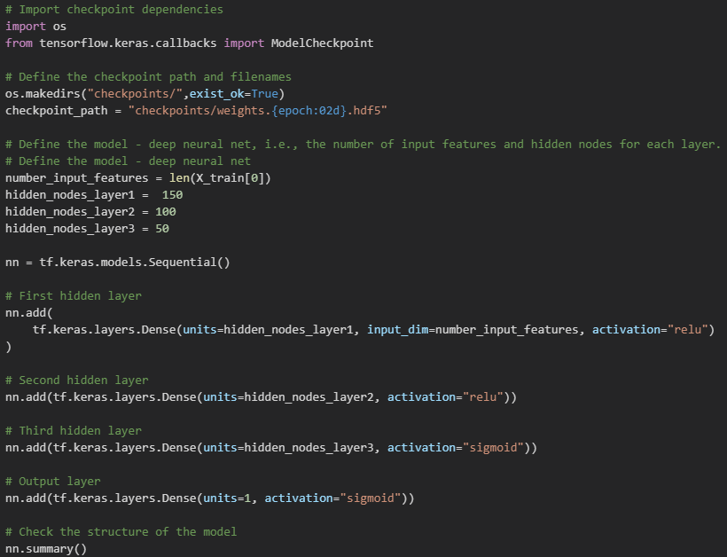

# Neural_Network_Charity_Analysis

## Overview
This project seeks to help the Alphabet Soup foundation predict where to make investments. Using machine learning and neural networks, a binary classifier was created that is capable of predicting whether they will be successful if funded by Alphabet Soup. 

## Results

### Data Preprocessing

  * The target is the predicted outcome, which in this case is the IS_SUCCESSFUL column. 

  * The features are all of the variables used to make a prediction which include all of the following: APPLICATION_TYPE, AFFILIATION, CLASSIFICATION, USE_CASE, ORGANIZATION, STATUS, INCOME_AMT, SPECIAL_CONSIDERATIONS, ASK_AMT

* EIN and NAME were removed from the dataset because they are identifiers, rather than variables.

### Compiling, Training, and Evaluating the Model

How many neurons, layers, and activation functions did you select for your neural network model, and why? 

Were you able to achieve the target model performance?
No, but I was able to get up to 73.12% from 72.96% with my second change. 

What steps did you take to try and increase model performance?
 1. First, I increased the amount of bins by changing the type_count (from <200 to <20) and class_count (from <1500 to <100). This improved the accuracy from 72.96% to 73.00%.
 2. Next, I increased the amount of bins by even more, with type_count changing to <10 and class_count changing to <50. The accuracy improved to 73.12%.
 3. Last, I changed the amount of neurons, layers, and activation functions. This decreased the accuracy back to 73.06%.

## Summary

Changing the number of bins helped the model the most, but adding another layer and changing the activation function to a sigmoid, did not help the accuracy.
